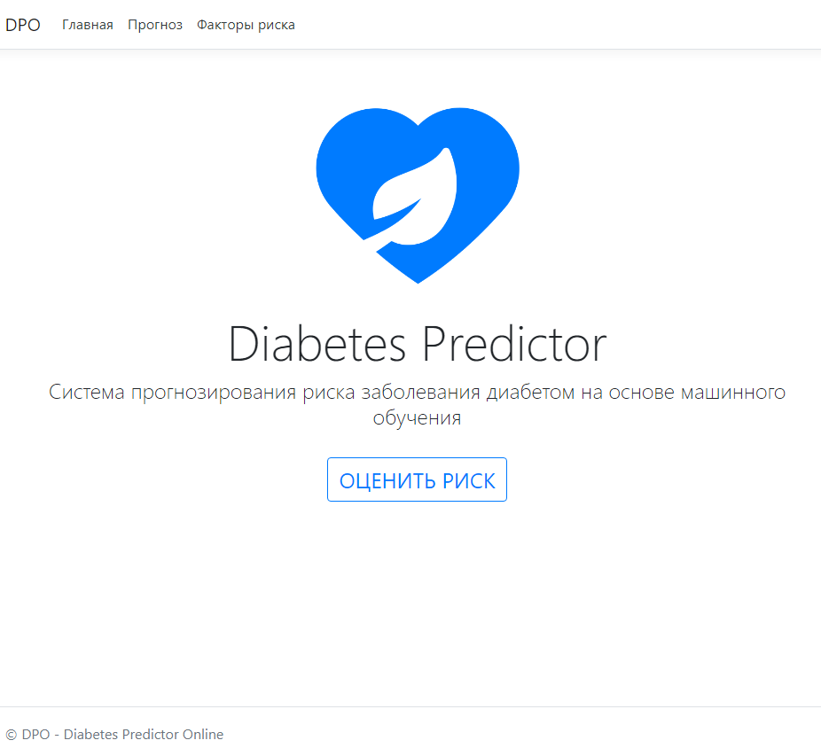
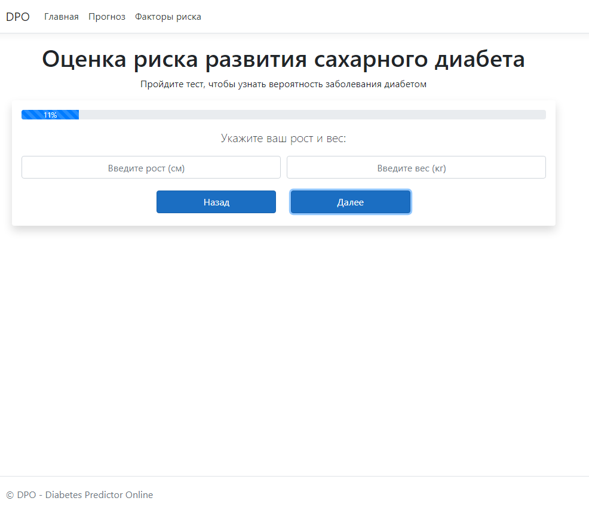
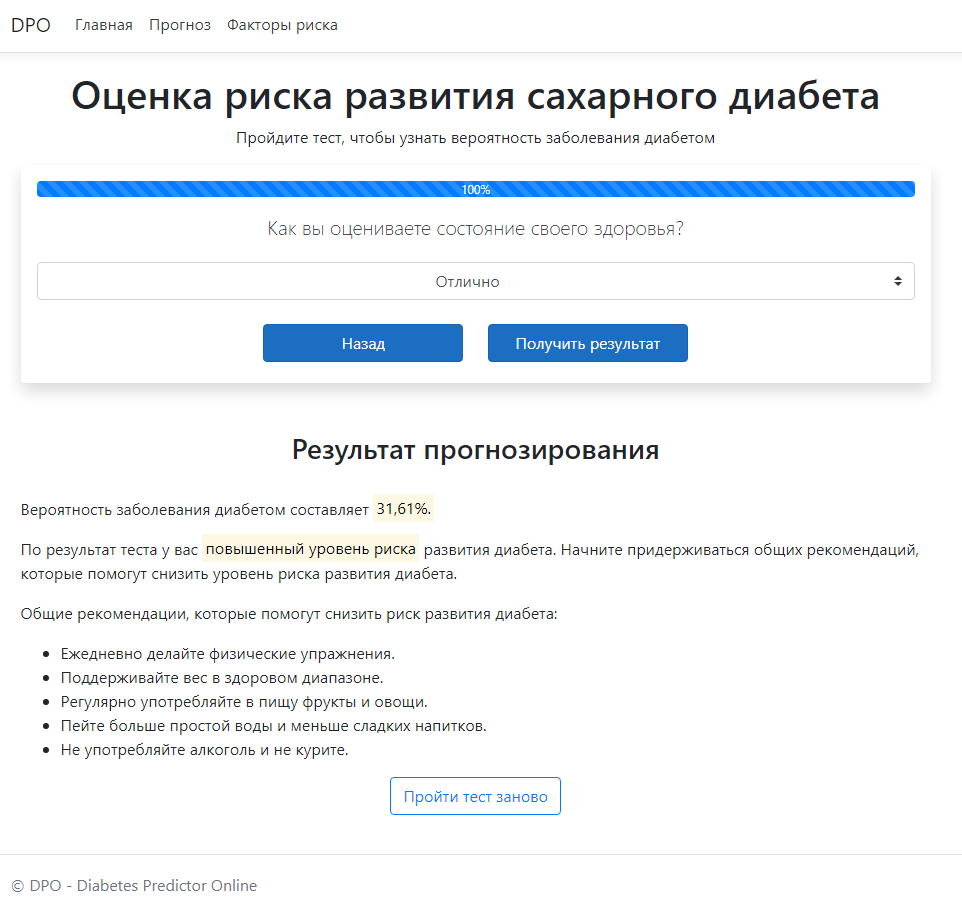
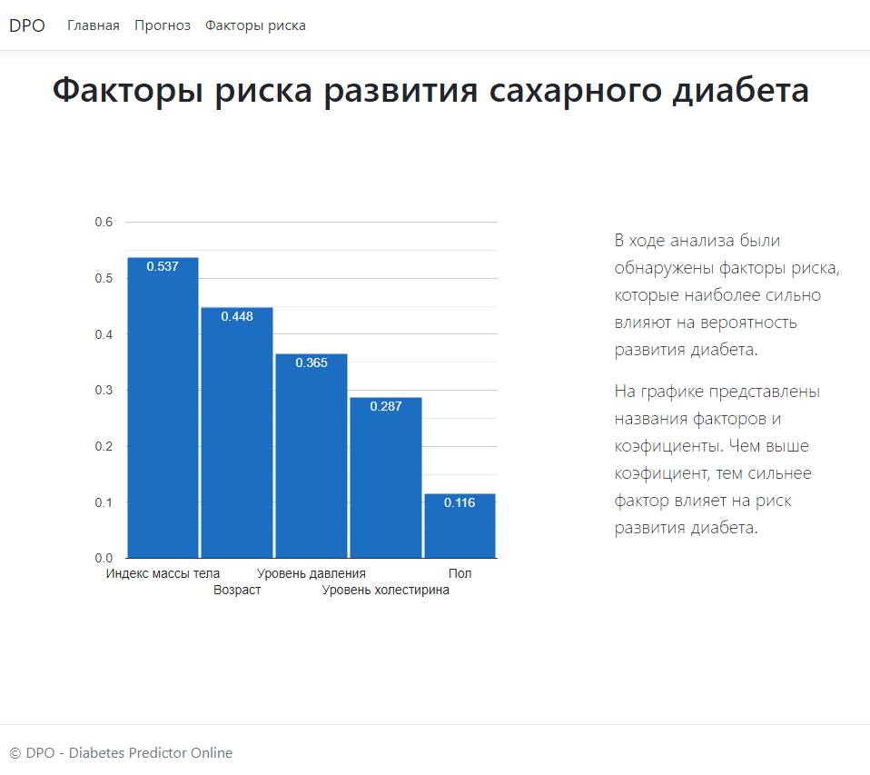

# Diabetes probability prediction system

The system consists of two parts:
1. Web application - responsible for the user interface.
2. Web API - responsible for performing forecasting.

### Web application
The application is implemented on the ASP NET Core. The architecture of the code is built according to the MVC pattern.
- Frontend: bootstrap, JS, razor.
- Backend: C#.

### Web API
The API contains a keras neural network model that performs diabetes prediction when a POST request is received. Data is exchange in JSON format. The API was created using the flask framework.

### Neural network model
The model is trained on data on health indicators, which are collected by the Behavioral Risk Factor Surveillance System (BRFSS). The input data of the model are answers to questions about the state of health. The description of the dataset is on [kaggle.com](https://www.kaggle.com/datasets/alexteboul/diabetes-health-indicators-dataset).

## How to use
1. Run file ml-api/main.py
2. Run file WebApplication/WebApplication.sln
3. Run IIS Express